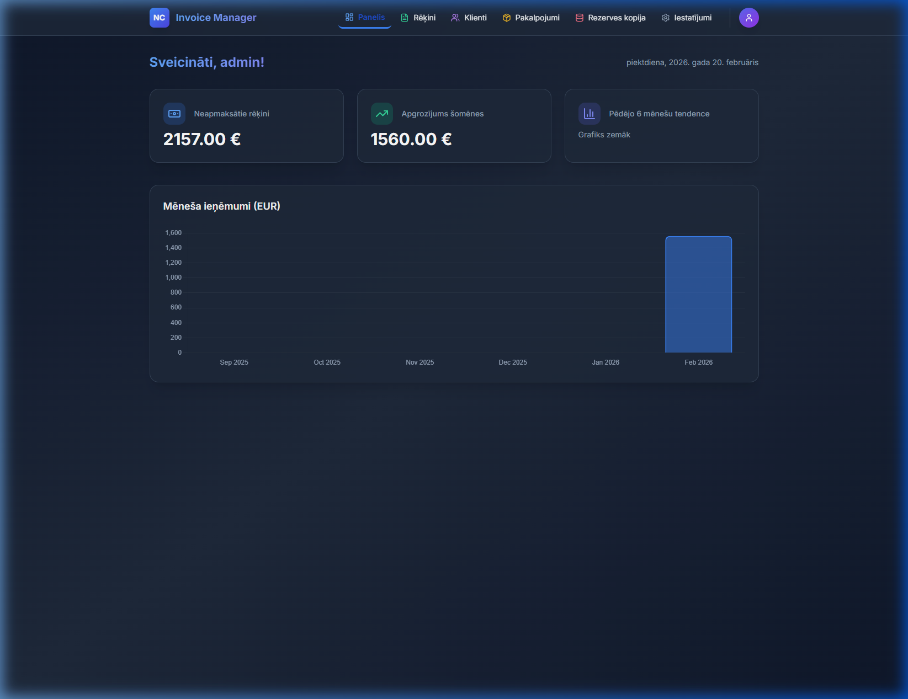

# 🧾 Rēķinu Pārvaldnieks (Invoice Manager)

Moderna un viegli lietojama rēķinu sagatavošanas un pārvaldības sistēma, kas pielāgota Latvijas tirgum.

## ✨ Galvenās funkcijas

- **Rēķinu ģenerēšana:** Automātiska PDF rēķinu izveide ar profesionālu dizainu.
- **E-rēķini (XML):** Atbalsts PEPPOL BIS 3.0 (UBL 2.1) standartam, kas ir obligāts darbam ar valsts iestādēm.
- **🏛️ VID EDS API integrācija:** Tieša rēķinu iesniegšana VID EDS sistēmā pa taisno no lietotnes.
- **Klientu datubāze:** Klientu rekvizītu automātiska ielāde no Latvijas atvērto datu reģistriem (pēc nosaukuma vai reģistrācijas numura).
- **✉️ E-pasta sūtīšana:** Iespēja nosūtīt sagatavotos rēķinus klientam tieši no lietotnes (SMTP).
- **☁️ Google Drive rezerves kopijas:** Automātiska rēķinu un datubāzes dublēšana Jūsu Google Drive kontā.
- **Pakalpojumu katalogs:** Saglabājiet biežāk izmantotos pakalpojumus un preces ātrai rēķinu aizpildīšanai.
- **Statistika:** Vizualizēts apgrozījuma pārskats pēdējiem mēnešiem.

## 📸 Sistēmas skati


*Galvenais panelis ar apgrozījuma statistiku un ātrajām norādēm.*


*Rēķinu un klientu pārvaldības saraksts.*


*Uzņēmuma rekvizītu, bankas un EDS konfigurācijas iestatījumi.*

## 🛠️ Tehnoloģijas

- **Backend:** Python (FastAPI, SQLAlchemy)
- **Frontend:** HTML5, Vanilla JavaScript, Tailwind CSS (moderns un ātrs UI)
- **Datubāze:** SQLite (glabājas lokāli `data/` mapē)

## 🚀 Uzstādīšana un lietošana

### 📥 Instalācijas fails (Windows lietotājiem)
Tagad programma ir pieejama kā klasiska, autonoma Windows aplikācija ar savu logu un instalatoru.

1. Lejuplādējiet instalācijas failu:
👉 **[Lejuplādēt NC_Invoice_Manager_Setup.exe](https://github.com/migors/rekinu-parvaldnieks/raw/main/dist/NC_Invoice_Manager_Setup.exe)**
2. Palaidiet lejuplādēto failu un sekojiet instalācijas soļiem.
3. Programma izveidos ikonu uz Jūsu darbvirsmas (Desktop) un būs atrodama "Start" izvēlnē.

*(Piezīme: Tā kā kods ir jauns un nav parakstīts ar dārgu korporatīvo sertifikātu, Windows SmartScreen var parādīt brīdinājumu. Spiediet "More info" un "Run anyway".)*

---

### Priekšnoteikumi (Izstrādātājiem)
- Python 3.10 vai jaunāks

### Uzstādīšanas soļi
1. Klonējiet repozitoriju:
   ```bash
   git clone https://github.com/migors/rekinu-parvaldnieks.git
   cd rekinu-parvaldnieks
   ```
2. Instalējiet nepieciešamās bibliotēkas:
   ```bash
   pip install -r requirements.txt
   ```
3. Palaidiet serveri:
   ```bash
   python -m uvicorn app.main:app --reload
   ```
4. Atveriet pārlūkprogrammu: `http://127.0.0.1:8000`

**Noklusējuma pieejas dati:**
- Lietotājvārds: `admin`
- Parole: `admin123`
*(Paroli var nomainīt Profila iestatījumos)*

## 📦 EXE faila izveide (Windows)

Ja vēlaties izmantot lietotni kā patstāvīgu programmu (`.exe`), izmantojiet pievienoto skriptu:
```bash
python build_exe.py
```
Gatavais fails parādīsies `dist/` mapē.

## 🔒 Drošība un dati
Visi dati (klienti, rēķini, iestatījumi) glabājas tikai Jūsu ierīcē `data/invoice.db` failā. Projekts ir veidots, prioritizējot datu privātumu un lokālu apstrādi.

---
*Izstrādāts ar Antigravity AI palīdzību.*
