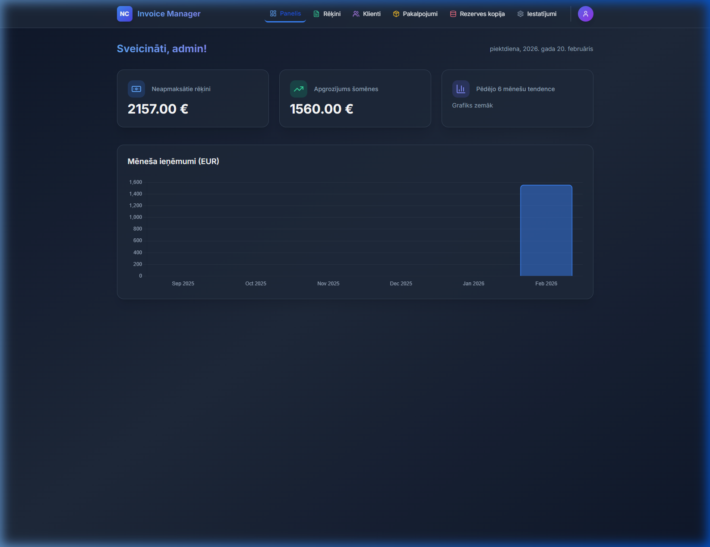
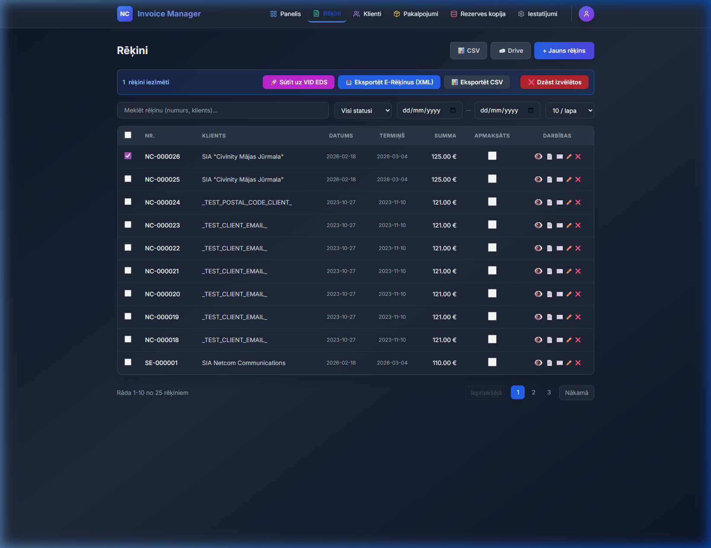
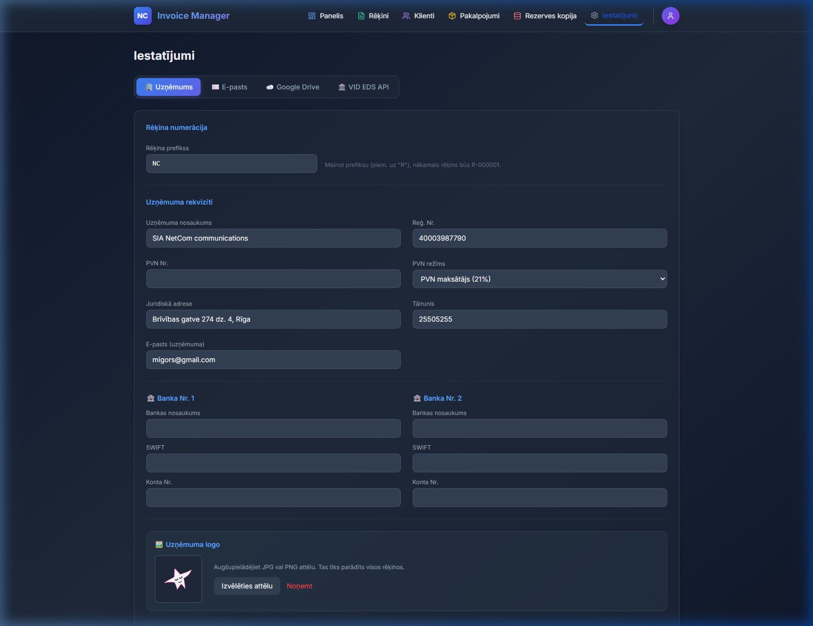

# 🧾 Rēķinu Pārvaldnieks (Invoice Manager)

Moderna un viegli lietojama rēķinu sagatavošanas un pārvaldības sistēma, kas pielāgota Latvijas tirgum.

🔗 **Vairāk informācijas un plašāks apraksts pieejams šeit:** [SEO's - Rēķinu pārvaldības rīks](https://seos.lv/noderigi/rekinu-parvaldibas-riks)

## ✨ Galvenās funkcijas

- **Rēķinu ģenerēšana:** Automātiska PDF rēķinu izveide ar profesionālu dizainu.
- **Skaista un funkcionāla saskarne:** Viss vienā logā. Rēķinu ģenerēšana, dublēšana un analītika.
- **"Save As" lejupielādes:** Atbalsts failu saglabāšanai ar izvēlētu nosaukumu PDF, CSV un XML formātiem.
- **Vizuāla atgriezeniskā saite:** Uzlabota lietotāja pieredze, piemēram, saglabāšanas pogas apstiprinājuma animācijas un izlecošie toast paziņojumi.
- **Daudzvalodu atbalsts PDF:** Latviešu rakstzīmju korekta attēlošana PDF rēķinos.
- **Integrācija ar VID EDS un Google Drive:** Tieša rēķinu sūtīšana uz EDS vienā klikšķī, un automātiska dublēšana mākonī.
- **Klientu datubāze:** Klientu rekvizītu automātiska ielāde no Latvijas atvērto datu reģistriem (pēc nosaukuma vai reģistrācijas numura).
- **✉️ E-pasta sūtīšana:** Iespēja nosūtīt sagatavotos rēķinus klientam tieši no lietotnes (SMTP).
- **☁️ Google Drive rezerves kopijas:** Automātiska rēķinu un datubāzes dublēšana Jūsu Google Drive kontā.
- **Pakalpojumu katalogs:** Saglabājiet biežāk izmantotos pakalpojumus un preces ātrai rēķinu aizpildīšanai.
- **Statistika:** Vizualizēts apgrozījuma pārskats pēdējiem mēnešiem.
- **📁 "Saglabāt kā" dialogs:** Visas lejupielādes (PDF, CSV, E-rēķins XML/ZIP, datubāzes backup) atver Windows "Save As" dialogu foldera izvēlei (Chrome/Edge). Firefox un vecāki pārlūki izmanto standarta lejupielādi.

## 📸 Sistēmas skati


*Galvenais panelis ar apgrozījuma statistiku un ātrajām norādēm.*


*Rēķinu un klientu pārvaldības saraksts.*


*Uzņēmuma rekvizītu, bankas un EDS konfigurācijas iestatījumi.*

## 🛠️ Sistēmas Uzbūves Tehnoloģijas (Tehniskā pieeja)

- **Backend:** Python (FastAPI, SQLAlchemy) lokālam serverim
- **Frontend:** HTML5, Vanilla JavaScript, Tailwind CSS (moderns un ātrs UI)
- **Datubāze:** SQLite (automātiska instalācijas versiju datubāzu formātu migrācija).
- **Logu pārvaldnieks (Native Window):** Microsoft Edge App Mode (`msedge.exe --app`). Agrāk izmantojām `pywebview`, taču tas izrādījās nestabils un neatbalstīts jaunākajā Python versijā (3.14). Izmantojot natīvo Windows pārlūku App režīmā, iegūstam tūlītēju, stabilu ielādi, pilnīgu CSS atbalstu un programmu bez "pārlūka paneļiem", kas uzvedas kā klasiska Desktop aplikācija ar logu sistēmas teknē (System Tray).

## 🚀 Uzstādīšana un lietošana

Nekas vairs nav jāatspiež (bez .zip), viss notiek pilnībā automātiski, kā ar jebkuru instalējamu programmu!

### 📥 Vienkāršā instalācija (Windows lietotājiem)

Mēs esam pilnveidojuši aplikāciju, un tagad tā ir pieejama kā klasiska, gatava instalācijas pakotne ar savu logu un saskarni.

1. Lejuplādējiet vienu vienīgu instalācijas failu:
👉 **[Lejuplādēt NC_Invoice_Manager_Setup.exe](https://github.com/migors/rekinu-parvaldnieks/raw/main/dist/NC_Invoice_Manager_Setup.exe)**
2. Palaidiet lejuplādēto failu. Ja Windows SmartScreen brīdina par nezināmu izstrādātāju, spiediet "More info" un tad "Run anyway", pēc tam sekojiet instalācijas soļiem klikšķinot "Tālāk".
3. Uzstādītājs radīs ikonu uz Jūsu darbvirsmas (Desktop) un arī Start izvēlnē. Kad palaidisiet, atvērsies programmas logs. Viss strādā!

Piezīme: Ja pārinstalējat aplikāciju (lai saņemtu atjauninājumu), jums nav jāsatraucas par vecajiem datiem - klientu `invoice.db` saglabājas `%APPDATA%` mapē, un paliks neskarts.

---

### Priekšnoteikumi izstrādātājiem (Koda vides palaišana)
- Python 3.10 vai jaunāks

### Koda uzstādīšanas soļi
1. Klonējiet repozitoriju:
   ```bash
   git clone https://github.com/migors/rekinu-parvaldnieks.git
   cd rekinu-parvaldnieks
   ```
2. Instalējiet nepieciešamās bibliotēkas:
   ```bash
   pip install -r requirements.txt
   ```
3. Palaidiet serveri:
   ```bash
   python -m uvicorn app.main:app --reload
   ```
4. Atveriet pārlūkprogrammu: `http://127.0.0.1:8000`

**Noklusējuma koda vides pieejas dati:**
- Lietotājvārds: `admin`
- Parole: `admin123`
*(Paroli var nomainīt Profila iestatījumos)*

## 📦 EXE instalācijas faila izveide

Ja jūs kā izstrādātājs gribat pielāgot kodu un izveidot jaunu `Setup.exe` savām vajadzībām:
1. Palaidiet skriptu, kas saģenerēs pašu pamatprogrammu:
```bash
python build_exe.py
```
2. Instalējiet *Inno Setup 6* programmu.
3. Nokompilējiet gala instalācijas paku, programmai uzrādot repozitorija mapē esošo `setup.iss` failu.
Viss parādīsies `dist/` mapītē gatavai instalēšanai.

## 🔒 Drošība un dati
Visi dati (klienti, rēķini, iestatījumi) fiziski nepamet Jūsu datoru, bet gan glabājas tikai konkrētajā iekārtā SQLite datubāzes failā `InvoiceManager\data\invoices.db`! Aplikācijai nav piekļuves ārējiem hostingiem (atskaitot Google Drive / SMTP e-pastu saskarnēm, ko konfigurējat Jūs pašu rokām).

---
*Izstrādāts ar Antigravity AI palīdzību.*
